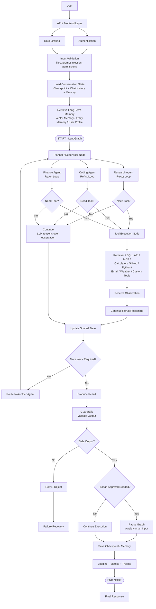
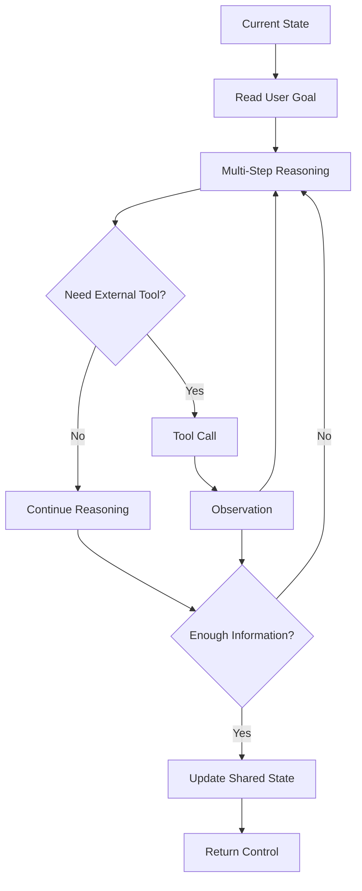
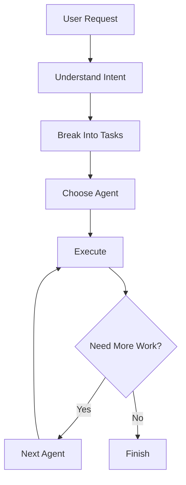
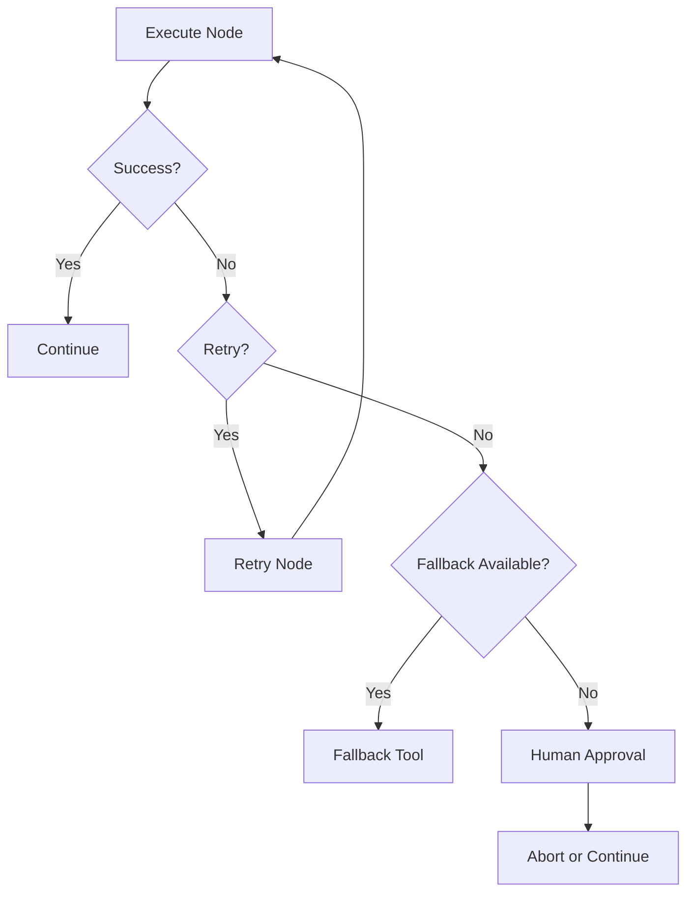
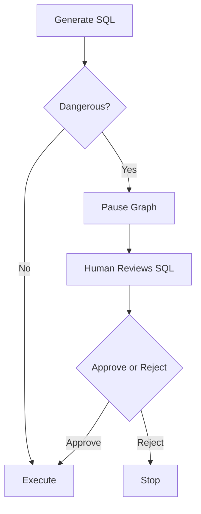

# LangGraph multi-agent architecture

## 1. Full request lifecycle



## 2. Agent reasoning loop (ReAct)



## 3. Shared state schema

```python
State = {
    # Conversation
    "messages": [],

    # Planner
    "current_task": "",
    "plan": [],

    # Memory
    "chat_history": [],
    "summary": "",
    "entities": {},
    "long_term_memory": [],

    # Retrieval
    "query": "",
    "retrieved_chunks": [],
    "reranked_chunks": [],

    # Tooling
    "tool_calls": [],
    "tool_results": [],

    # Agents
    "active_agent": "",
    "next_agent": "",

    # Output
    "draft_answer": "",
    "final_answer": "",

    # Errors
    "retry_count": 0,
    "error": None,

    # Human Approval
    "approval_required": False,
    "approval_status": None,

    # Metadata
    "session_id": "",
    "user_id": "",
    "cost": 0,
    "token_usage": 0,
}
```

## 4. Planner / supervisor



## 5. Failure recovery graph



## 6. Human-in-the-loop (e.g. SQL execution)


